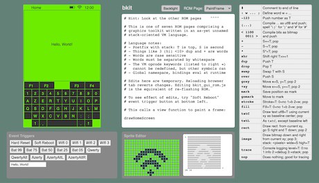
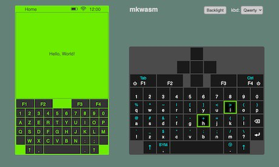

# ui_sim

user interface simulator for a handheld multilingual communication device

## Demo Pages

1. [gui toolkit](https://samblenny.github.io/ui_sim/www/)

   

2. [mkwasm on-screen keyboard](https://samblenny.github.io/ui_sim/mkwasm/www/)

   

## What is this about?

The the point is to prototype user interface ideas for a handheld communication
device, with an emphasis on multilingual keyboard layouts.

The approach is to simulate a keyboard, LCD, microkernel, and graphics server
to enable work on user facing software that could be conveniently ported to a
real microkernel, on real hardware, once those are ready.

## Repository Tour

- **mkwasm** (rust): Simulated microkernel using message passing over
  webassembly shared memory IPC. Keyboard and graphics use browser APIs with
  javascript. Everything else runs as cross-compiled webassembly rust library.

- **mktcp** (rust): Simulated microkernel using message passing over local tcp.
  Keyboard and graphics use browser APIs with javascript. Everything else runs
  as native-compiled rust binary.

- **www** (html/css/js): Static web pages with user interface components
  including simulated keyboard hardware, simulated LCD, graphics toolkit rom
  editor, sprite editor, and debug monitor.

- **img** (jpeg): Screenshots

- **kbddrv** (rust): Keyboard layout drivers
