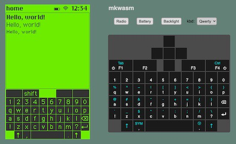

# ui_sim

user interface simulator for a handheld multilingual communication device

## Demo Pages

1. [gui toolkit](https://samblenny.github.io/ui_sim/www/)

   

2. [mkwasm on-screen keyboard](https://samblenny.github.io/ui_sim/mkwasm/www/)

   
