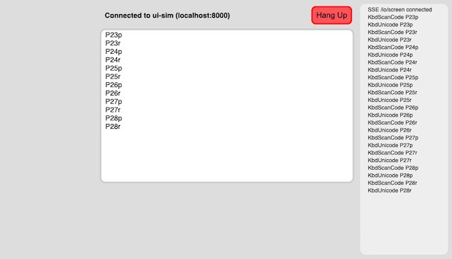

# ui_sim

user interface simulator for a handheld multilingual communication device

## Quick Start

1. Make sure you have `rustc` and `cargo` installed

2. In a terminal, `git clone` this repo and `cd ui_sim`

3. `cargo run`

4. Wait for the `Server 0 ready: http://127.0.0.1:8000` message

5. Load http://127.0.0.1:8000 in a browser that supports modern javascript APIs

6. [Optional] Open the developer tools so you can see javascript log messages

7. Click the big green "Connect to ui_sim (localhost:8000)" button

8. Type stuff... you should see a trace of event messages simulating data
   flow from a hardware keyboard ISR, into a microkernel, then through a
   keyboard driver, application program, and graphics user interface toolkit.
   [simulation is lo-fi... imagination helps]

9. When you are done, click the big red "Hang Up" button in the browser,
   and do a control-c in the terminal to stop ui_sim

## Explanation

This is a simulation of a handheld device running a microkernel with channel
based IPC. The main point is to experiment with user experience around keyboard
drivers for multilingual hardware keyboards (i.e. play with state machines).

The keyboard and screen portion of the simulation uses HTML/CSS/JS/SVG with
browser fetch and EventSource APIs for communicating with the rust code.

The microkernel IPC portion is simulated in rust with a mixture of HTTP
sockets, threads, and `std::sync::mpsc` channels.

The keyboard drivers, written in rust, should be close to the real thing.
